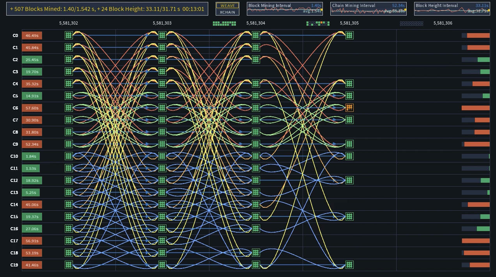
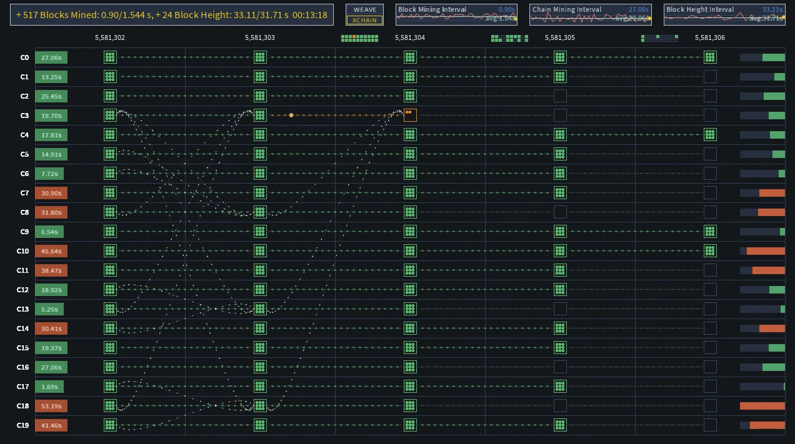
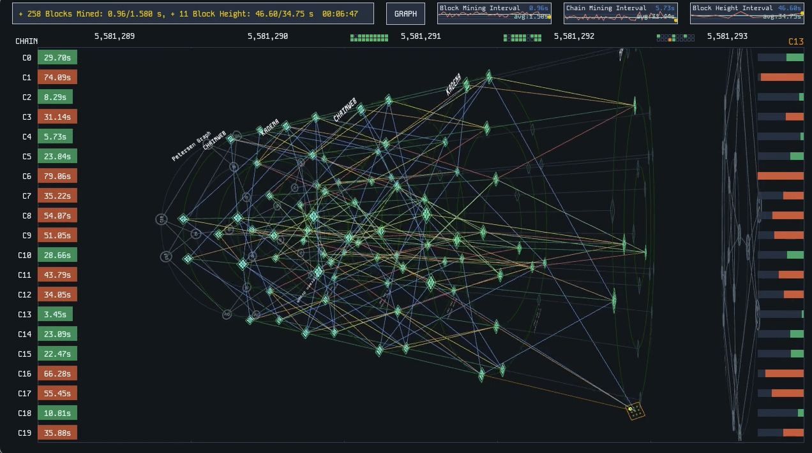

# ChainWeb Mining Simulator

A visual simulation of the Kadena ChainWeb parallel blockchain mining process, implemented in Processing.

## Overview

ChainWeb Mining Simulator is an interactive visualization tool that demonstrates the parallel mining process of Kadena's ChainWeb blockchain. The simulator shows how 20 parallel chains mine blocks concurrently while respecting cross-chain dependencies, creating a web-like structure of interconnected blockchains.

## Features

- **Real-time Mining Simulation**: Visualizes the mining process across 20 parallel chains with dynamic block creation, mining state transitions, and dependency validation.
- **Multiple Visualization Modes**:
- **WEAVE**: Traditional grid view showing all chains and block relationships
   
- **XCHAIN**: Cross-chain dependency visualization with animated connections
   
- **GRAPH**: 3D network view with concentric circles representing chain positions and dependencies
   
- **Detailed Mining Metrics**: Tracks and displays mining time, block intervals, and chain performance
- **Interactive Controls**: Toggle between viewing modes, manipulate the 3D view, and explore the network structure

## Controls

- **Space**: Toggle between visualization modes (WEAVE, XCHAIN, GRAPH)
- **P key**: Toggle Petersen Graph display in GRAPH mode
- **Mouse Wheel**: Zoom in/out in GRAPH mode
- **Mouse Movement**: Adjust camera angle in GRAPH mode

## Technical Implementation

The simulator implements a simplified model of the ChainWeb protocol, featuring:

- **Parallel Chain Structure**: 20 independent chains with cross-chain dependencies
- **Block Validation**: Enforces dependency rules where blocks can only be mined after their dependencies are satisfied
- **Metrics Visualization**: Real-time charts displaying mining performance and statistics
- **Animated Transitions**: Smooth animations for block mining, dependency activation, and chain progression

## Background

ChainWeb is a parallel-chain architecture developed by Kadena that achieves increased throughput by allowing multiple chains to operate simultaneously while maintaining overall blockchain security through a unique directed acyclic graph (DAG) structure of cross-chain dependencies.

In the ChainWeb architecture, each chain depends on several other chains when creating new blocks, forming a pattern inspired by the Petersen graph. This dependency structure ensures that an attacker would need to control a significant portion of the network's hash power to successfully attack any individual chain.

For more details about the ChainWeb protocol and Kadena's blockchain technology, visit the [Kadena website](https://kadena.io).

## To run this simulator

1. Download and install [Processing](https://processing.org/download)
2. Open the `.pde` files in the Processing IDE
3. Run the sketch

## Or running the Simulator from the Command Line

To run the simulator from the command line, follow these steps:

1. Ensure you have [Processing](https://processing.org/download) installed on your system.
2. Navigate to the directory containing the simulator files:
   ```bash
   cd /Users/vootaa/ChainWeb_MiningSimulator
   ```
3. Use the `processing-java` command to run the simulator. This command is part of the Processing installation and allows you to execute sketches from the command line:
   ```bash
   processing-java --sketch=`pwd` --run
   ```
4. The simulator will launch, and you can interact with it as described in the Controls section.

## 🎥 Video Demonstrations

To better understand the ChainWeb Mining Simulator, you can watch the following video demonstrations:

- **[V05A.mp4](mp4/V05A.mp4)**: Demonstrates the WEAVE mode and its visualization of cross-chain dependencies.
- **[V05F.mp4](mp4/V05F.mp4)**: Showcases the GRAPH mode with 3D network visualization and interactive controls.

## License

MIT License - See [LICENSE](LICENSE) file for details.
